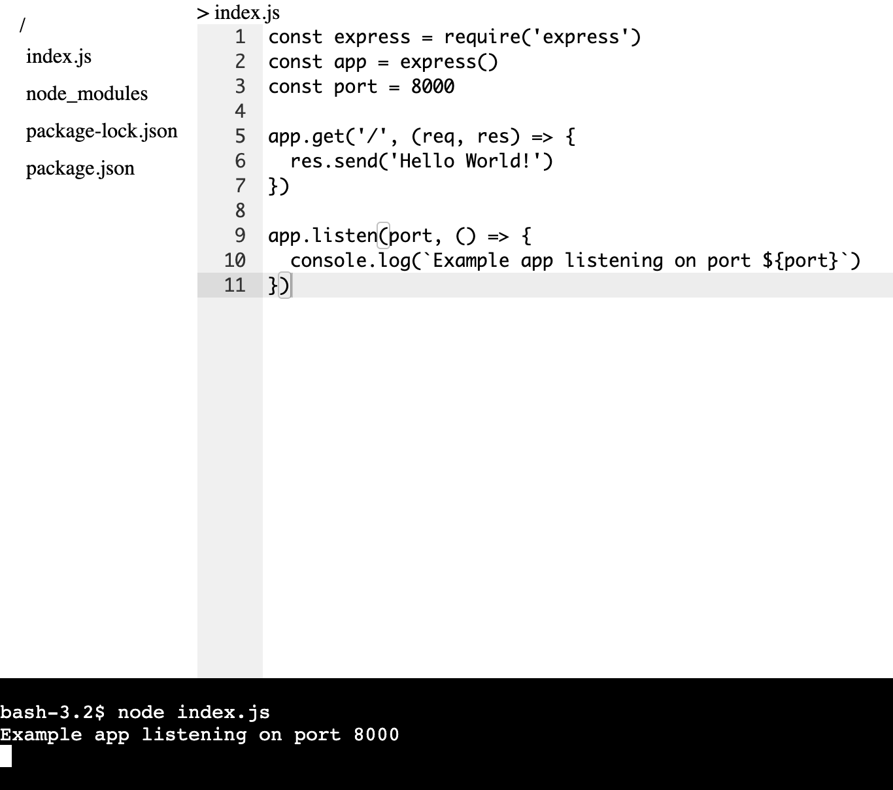

# Cloud IDE

This Cloud IDE is built using Node.js, React.js, and Socket.IO to provide a real-time, collaborative development environment. It allows users to write, edit, and run code directly in the cloud, offering a seamless experience for remote development.

<p align="center">
  
</p>

## Features
<div align="center">

| Feature                      | Description                                   |
|------------------------------|-----------------------------------------------|
| **Real-time Collaboration** | Multiple users can code together in real-time, enhancing team productivity.       |
| **Live Preview**                    | Instant code execution and live preview for faster feedback loops.|
| **Scalable and Flexible**               | Designed to scale, offering a responsive and user-friendly interface.|
  
</div>

## Technologies
- React.js
- Node.js
- Socket.io
  

## Installation
### Prerequisites
- Node.js
- npm or yarn

### Steps

1. Clone the repository
    ```bash
    git clone https://github.com/Siratul804/Could-IDE.git
    ```
2. Navigate to the project directory
    ```bash
    cd your-repo
    ```
3. Install dependencies
    ```bash
    npm install
    ```
4. Run App
    ```bash
    npm run dev
    ```
## Tree Syntax 

```bash
  <div
      onClick={(e) => {
        e.stopPropagation();
        if (isDir) return;
        onSelect(path);
      }}
      className="tree_main"
    >
      <div style={{ paddingLeft: "5px" }}>{fileName}</div>
      {nodes && fileName !== "node_modules" && (
        <ul>
          {Object.keys(nodes).map((child) => (
            <li>
              <FileTreeNode
                onSelect={onSelect}
                path={path + "/" + child}
                fileName={child}
                nodes={nodes[child]}
              />
            </li>
          ))}
        </ul>
      )}
    </div>
```
    
## Editor Syntax 

```bash
 <div className="editor">
            {selectedFile && <p>{selectedFile.replaceAll("/", " > ")}</p>}
            <AceEditor
              fontSize={14}
              lineHeight={19}
              showPrintMargin={true}
              showGutter={true}
              highlightActiveLine={true}
              value={code}
              style={{ width: "110vh" }}
              onChange={(e) => setCode(e)}
              setOptions={{
                enableBasicAutocompletion: true,
                enableLiveAutocompletion: true,
                enableSnippets: true,
                showLineNumbers: true,
                tabSize: 2,
              }}
            />
          </div>
```


    
## Terminal Syntax 

```bash

function Terminal() {
  const terminalRef = useRef();
  const isRendered = useRef(false);

  useEffect(() => {
    if (isRendered.current) return;
    isRendered.current = true;
    const term = new XTerminal({
      rows: 20,
    });
    term.open(terminalRef.current);

    term.onData((data) => {
      socket.emit("terminal:write", data);
    });

    socket.on("terminal:data", (data) => {
      term.write(data);
    });
  });
  return <div ref={terminalRef} id="terminal" />;
}

```


<p align="center">
<b>Made with ❤️ by   <a href="https://github.com/Siratul804">  Siratul Islam </a> </b> 
</p>

<p align="center">
  <a href="https://github.com/Siratul804?tab=repositories">View Project</a> •
  <a href="https://github.com/Siratul804">GitHub Profile</a> •
  <a href="https://www.linkedin.com/in/siratulislam/">LinkedIn</a> •
  <a href="https://x.com/Siratul074">Twitter</a>
</p>

<p align="center">
  <small>© 2024 Siratul Islam. All rights reserved.</small>
</p>
